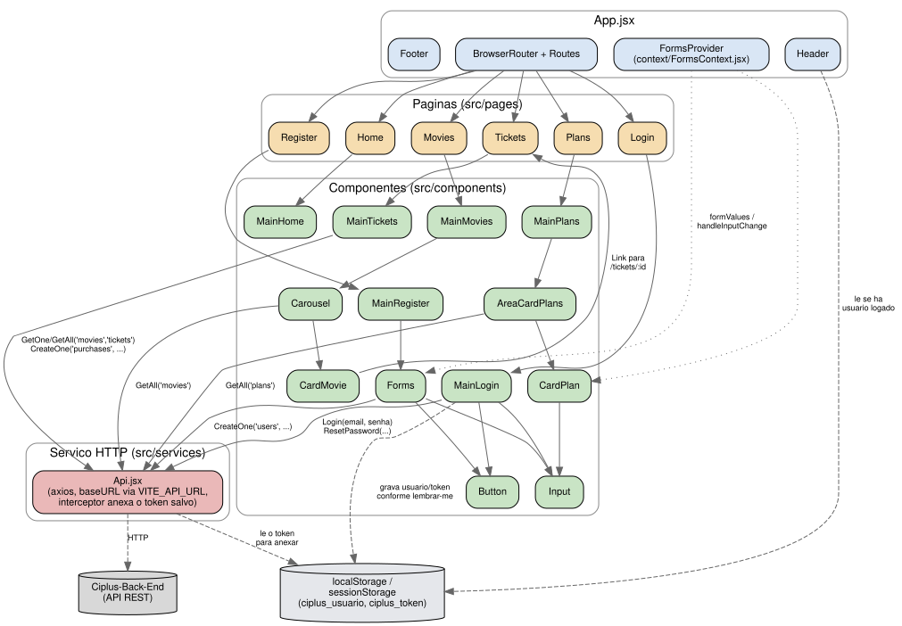

# Ciplus+

Front-end do **Ciplus**, um sistema de venda de ingressos e planos de assinatura para cinema, construído em React com Vite. Foi desenvolvido como projeto de módulo final do curso da Resilia Educação em parceria com a Stone, consumindo a API REST construída no módulo anterior. Usa React Router para navegação entre páginas, Context API para compartilhar o estado dos formulários e styled-components para estilização.

> **Back-End:** [Ciplus-Back-End](https://github.com/GustavoVieiraDeAraujo/Ciplus-Back-End)

---

## Sumario

- [Colaboradores](#colaboradores)
- [Tecnologias](#tecnologias)
- [Rotas](#rotas)
- [Estrutura do Projeto](#estrutura-do-projeto)
- [Requisitos](#requisitos)
- [Configuracao](#configuracao)
- [Como Executar](#como-executar)
- [Arquitetura](#arquitetura)

---

## Colaboradores

| Nome | GitHub |
| --- | --- |
| Gustavo Vieira de Araújo | [@GustavoVieiraDeAraujo](https://github.com/GustavoVieiraDeAraujo) |
| Isabella Oliveira | [@isabellaoliv](https://github.com/isabellaoliv) |
| Marlon Alves | [@Marlonalvss](https://github.com/Marlonalvss) |
| Alexandre Bastos | [@xand3](https://github.com/xand3) |
| Diego Tavares | [@taaraves](https://github.com/taaraves) |

---

## Tecnologias

| Tecnologia | Uso |
| --- | --- |
| React | Biblioteca de componentes; toda a interface é construída como árvore de componentes funcionais com hooks |
| Vite | Bundler e servidor de desenvolvimento (`npm run dev`, `npm run build`) |
| React Router DOM | Roteamento client-side entre as páginas (`/`, `/login`, `/movies`, `/plans`, `/register`, `/tickets`, `/tickets/:movieId`) |
| styled-components | CSS-in-JS; cada componente tem um `styles.jsx` com os estilos gerados via template literals |
| Axios | Cliente HTTP usado em `src/services/Api.jsx` para falar com o Ciplus-Back-End |
| React Input Mask | Máscaras de campo (data de nascimento, telefone, CPF) no formulário de cadastro |
| Context API | `src/context/FormsContext.jsx` compartilha `formValues`/`handleInputChange` entre `Forms` e `CardPlan` |

---

## Rotas

| Rota | Página | Descrição |
| --- | --- | --- |
| `/` | Home | Landing page com destaque visual, cards dos planos e chamada para `/plans` |
| `/login` | Login | Formulário de e-mail/senha que chama `Login(email, senha)`; em caso de sucesso salva usuário e token em `localStorage` (ou `sessionStorage`, conforme "Lembrar de mim") e volta para `/`, em caso de falha mostra "E-mail ou senha inválidos". "Esqueceu sua senha?" abre um mini-formulário (CPF + nova senha) que chama `POST /users/reset-password` |
| `/movies` | Movies | Carrossel de filmes em cartaz, carregado via `GetAll("movies")`; cada card leva para `/tickets/:id` do respectivo filme |
| `/plans` | Plans | Lista os planos de assinatura carregados via `GetAll("plans")`; cada card leva para `/register` |
| `/register` | Register | Formulário de cadastro (nome, nascimento, telefone, CPF, e-mail, senha) que envia `CreateOne("users", ...)` |
| `/tickets` e `/tickets/:movieId` | Tickets | Detalhe de um filme real (sinopse, classificação, duração, gênero, pôster) com compra de ingresso: escolha de sessão (a partir de `movie_sessions`) e tipo de ingresso (`GetAll("tickets")`), e confirmação que grava a compra via `CreateOne("purchases", ...)`. Sem `:movieId` (ex.: pelo link genérico "Ingressos" do menu), usa o primeiro filme da lista |

---

## Estrutura do Projeto

| Diretorio / Arquivo | Descricao |
| --- | --- |
| `index.html` | Ponto de entrada Vite, carrega `src/main.jsx` |
| `src/main.jsx` | Renderiza `<App />` na raiz `#root` |
| `src/App.jsx` | Define `BrowserRouter`, `FormsProvider`, `Header`/`Footer` fixos e as seis `Route` |
| `src/Global.css` | Reset e estilos globais (fontes, box-sizing) |
| `src/services/Api.jsx` | Wrapper do Axios com as operações CRUD genéricas (`GetAll`, `GetOne`, `CreateOne`, `CreateMany`, `UpdatePut`, `UpdatePatch`, `DeleteOne`, `DeleteMany`), `Login(email, senha)` e `ResetPassword(email, cpf, novaSenha)`; um interceptor de requisição anexa `Authorization: Bearer <token>` automaticamente quando existe um token salvo |
| `src/utils/posterFallback.js` | SVG embutido ("Pôster indisponível") usado quando `movie_image_link` não carrega |
| `src/context/FormsContext.jsx` | Context que guarda `formValues` e `handleInputChange`, consumido por `Forms` e `CardPlan` |
| `src/pages/*.jsx` | Um componente por rota, cada um apenas renderiza o respectivo `Main*` de `src/components` |
| `src/components/Header` | Barra de navegação fixa (logo, links para Filmes/Cadastre-se); mostra "Entrar" ou "Olá, `<nome>` (Sair)" conforme houver usuário salvo em `localStorage`/`sessionStorage` |
| `src/components/Footer` | Rodapé; "minha conta" leva para `/login` e "catálogo" para `/movies`, o resto (redes sociais, "ajuda", newsletter) continua placeholder |
| `src/components/MainHome` | Conteúdo da Home |
| `src/components/MainLogin` | Login (com "lembrar de mim" controlando `localStorage` vs `sessionStorage`) e o mini-formulário de "esqueci minha senha" |
| `src/components/MainMovies` / `Carousel` / `CardMovie` | Página de filmes: navegação interna, carrossel horizontal e card individual de filme; cada `CardMovie` é um `Link` para `/tickets/:id`, com fallback de imagem se o pôster não carregar |
| `src/components/MainPlans` / `AreaCardPlans` / `CardPlan` | Página de planos: busca os planos na API e renderiza um `CardPlan` por item |
| `src/components/MainRegister` / `Forms` / `Input` / `Button` | Formulário de cadastro genérico, reaproveitado pelos campos de texto/data/telefone/CPF/e-mail/senha |
| `src/components/MainTickets` | Detalhe do filme (via `movieId` da rota) e compra de ingresso: sessão, tipo de ingresso, quantidade e confirmação, gravada em `Purchases` no back-end (rejeitada se a sessão já estiver lotada) |
| `src/components/*/assets` | Imagens usadas por cada componente (banners, posters, ícones) |

---

## Requisitos

| Dependencia | Versao | Instalacao |
| --- | --- | --- |
| Node.js | 18 ou superior (testado com Node 22) | [nodejs.org](https://nodejs.org) ou um gerenciador de versões (`nvm`, `mise`) |
| Dependências do projeto | conforme `package.json` | `npm install` |

```bash
npm install
```

---

## Configuracao

A URL base da API é configurável pela variável de ambiente `VITE_API_URL` (lida em `src/services/Api.jsx`). Se não for definida, o projeto cai de volta para `http://localhost:3000/`, endereço padrão do [Ciplus-Back-End](https://github.com/GustavoVieiraDeAraujo/Ciplus-Back-End) rodando localmente (o back-end original, hospedado no Heroku, saiu do ar em nov/2022 com o fim do plano gratuito). Para apontar para outra instância:

```bash
# .env.local (não versionado, já coberto por *.local no .gitignore)
VITE_API_URL=http://localhost:3000/
```

---

## Como Executar

```bash
# instala as dependências
npm install

# sobe o servidor de desenvolvimento em http://localhost:5173
npm run dev

# gera o build de produção em dist/
npm run build

# serve o build de produção localmente
npm run preview
```

O README original do projeto documentava `npm start`, mas o `package.json` nunca teve esse script. Os comandos corretos são os do Vite (`dev`/`build`/`preview`) listados acima.

---

## Arquitetura



| Camada | Responsabilidade |
| --- | --- |
| `App.jsx` | Monta o roteador, o provider de formulários e os elementos fixos (`Header`/`Footer`) |
| Páginas (`src/pages`) | Um wrapper fino por rota, sem lógica própria |
| Componentes (`src/components`) | Telas (`Main*`) e peças reutilizáveis (`Input`, `Button`, `CardMovie`, `CardPlan`) |
| Serviço HTTP (`src/services/Api.jsx`) | Único ponto de acesso à API, usado pelos componentes que precisam buscar ou enviar dados |
| Back-End (Ciplus-Back-End) | API REST externa que fornece filmes, planos, tickets, usuários (com login) e compras de ingresso |

---

> Documentacao gerada com auxilio de IA.
